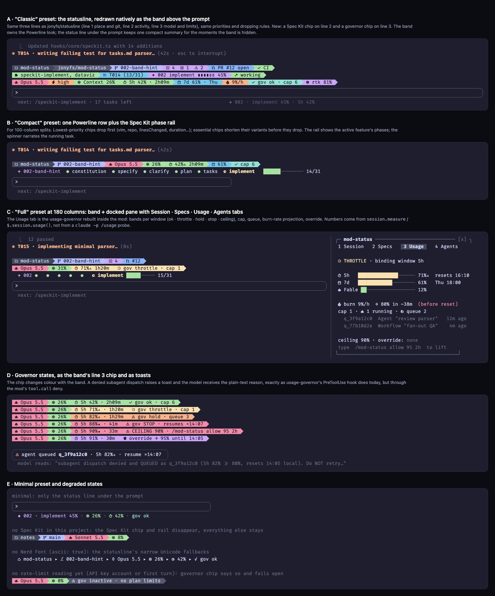

# 🧭 Astrolabe

A Claude Code mod that shows where your session is and where it is heading: the
project, git and model state from a classic status line, live Spec Kit progress, and
usage-window governance that keeps subagent fan-out under your plan limits.

> **Status: in design, not installable yet.** The commands below describe the first
> release (v0.1.0) and do not work until it is tagged. Progress is tracked as Spec Kit
> features under `specs/`.

## Why "Astrolabe"

An astrolabe is a handheld instrument that astronomers and navigators used for centuries.
You sight a star or the sun through it, read how high the body stands above the horizon,
and from that one reading work out the time of day and where you are. Its front plate,
the rete, is a rotating map of the sky laid over the fixed coordinates of one place.

The mod does the same job for a coding session. It reads altitude: how full the context
window is, and how far the 5-hour and weekly usage windows have climbed. It turns those
readings into time: when each window resets and, at the current burn rate, when you would
reach 80%. It gives your position: the directory, branch and pull request, and which Spec
Kit feature you are in and at which phase (specify, clarify, plan, tasks, implement).

Navigators also steered by the astrolabe, and the mod acts on its readings too. When a
usage window gets high it slows down or queues new subagent dispatches, and it resumes
them after the reset.

The emoji is 🧭 because Unicode has no astrolabe. The compass is the closest navigation
instrument it offers, and the repository, the mod and its messages all use it.

## What it will show

Astrolabe draws in the places Claude Code lets a mod use. Everything uses the same
FiraCode Nerd Font glyphs and Catppuccin palettes (mocha, frappe, macchiato, latte) as
jonyfs/statusline.

| Place | What appears there |
|---|---|
| Band above the prompt | Up to three Powerline rows: place and git (directory, branch, changes, PR, CI); activity (skills in use, current todo, Spec Kit chip, working or idle); model and limits (model, effort, context, 5h and 7d windows, burn rate, governor state). |
| Status line under the prompt | One compact summary, for example `◆ 002 · implement 45% · 5h 42% · gov ok`. |
| Prompt hint | The next Spec Kit command, for example `next: /speckit-implement · 17 tasks left`. |
| Spinner | The task being worked on, for example `✻ T014 · writing failing test for tasks.md parser…`. |
| Pane `/astrolabe` | Tabs for Session, Specs (every feature with its phase and progress), Usage (windows, bands, queue, override) and Agents. |
| Toasts | A Spec Kit phase finished, a task ticked with no code edited, a subagent dispatch queued. |

Presets choose which of these are on. Version 1 ships three:

| Preset | Band | Status line | Prompt hint | Spinner | Pane |
|---|---|---|---|---|---|
| `minimal` | | yes | | | on command |
| `compact` (default) | one Powerline row and the Spec Kit phase rail | yes | yes | yes | on command |
| `full` | the three statusline rows | yes | yes | yes | also opens by itself at 144 columns or more |

The design study shows every preset and state:
[docs/design/study.html](docs/design/study.html) (rendered:
[docs/design/study.png](docs/design/study.png)).



## Usage governance

Astrolabe includes the usage-governor policy for Claude Code. It reads the usage windows
that Claude Code reports to the mod after each turn, so it does not start a background
`claude -p /usage` process.

| Band | Highest window | What happens to new subagent dispatches |
|---|---|---|
| ok | below 60% | up to 6 at once |
| throttle | 60% to 80%, or on pace to cross 80% before the reset | cap of 3, then 1 |
| hold | 80% or more | denied and queued |
| stop | 88% or more | denied and queued; the session pauses and resumes at the reset |
| ceiling | 90% or more | only read-only tools until the owner lifts it |

Only you can lift the ceiling, by typing the command the notice shows, for example:

```text
/astrolabe allow 95 2h
```

A running subagent is never stopped.

## Install (from v0.1.0)

In a Claude Code terminal session (version 2.1.292 or later):

```text
/plugin install astrolabe --marketplace jonyfs/astrolabe
```

Answer `y` to `Add marketplace?`, pick the user scope, and the mod is active in the same
session. The longer form also works:

```text
/plugin marketplace add jonyfs/astrolabe
/plugin install astrolabe@astrolabe
```

Update with `claude plugin update astrolabe@astrolabe`.

You need a Nerd Font in your terminal for the icons (FiraCode Nerd Font and MesloLGS NF
both work). Without one, set the `ascii` option and Astrolabe uses plain Unicode symbols.

## Where it draws nothing

Mods draw in the terminal and in the Code tab of the Claude Desktop app. In the VS Code
extension, `claude -p` and cloud sessions the mod's hooks still run, so usage governance
keeps working, but nothing is drawn. Astrolabe replaces jonyfs/statusline, so those
surfaces get no status bar.

## Development

Every change starts as a Spec Kit feature under `specs/` and goes through
`/speckit-specify`, `/speckit-clarify`, `/speckit-plan`, `/speckit-tasks`,
`/speckit-analyze` and `/speckit-implement`, test-first. The rules are in
[.specify/memory/constitution.md](.specify/memory/constitution.md). Everything in this
repository is written in English.

## License

MIT. See [LICENSE](LICENSE).
