# 🧭 Astrolabe

A Claude Code mod that shows where your Spec Kit work stands and keeps your session under
its usage limits: a phase rail above the prompt, the next command to run, the task in
progress, a pane with every feature, toasts when something changes, buttons that install
updates, and a status entry with your fullest usage window.

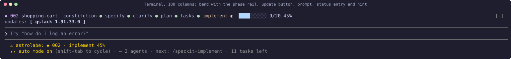

> **Version 0.8.1.** Every image in this README is a capture of the real mod running in Claude
> Code 2.1.292, made with `scripts/capture/scene.sh` in the demo project
> [docs/demo/](docs/demo/) (see [How the images are made](#how-the-images-are-made)).

## At a glance

| Where | What Astrolabe draws | Section |
|---|---|---|
| Above the prompt | The active feature, the six Spec Kit steps, a progress bar, and buttons for updates | [The band](#what-the-band-shows) |
| Under the prompt | `◆ 002 · implement 45% · 5h 42%`: feature, phase, progress, usage window | [The status entry](#what-the-status-entry-shows) |
| The hint line | `next: /speckit-implement · 11 tasks left` | [The prompt hint](#what-the-prompt-hint-shows) |
| The spinner | `… T011 · Show an empty-cart message · 1s` while Claude works on the feature | [The spinner](#what-the-spinner-says) |
| `/astrolabe` | A pane with Specs, Tasks and Session tabs | [The pane](#the-astrolabe-pane) |
| Toasts | A task ticked with no code edited; a phase finished | [Toasts](#toasts) |
| Tool calls | New subagents capped or held, the session paused near the limit | [Usage governance](#usage-governance) |

## Why "Astrolabe"

An astrolabe is a handheld instrument that astronomers and navigators used for centuries.
You sight a star or the sun through it, read how high the body stands above the horizon,
and from that one reading work out the time of day and where you are. Its front plate,
the rete, is a rotating map of the sky laid over the fixed coordinates of one place.

The mod does the same job for a coding session. It reads altitude: how full the context
window is, and how far the 5-hour and weekly usage windows have climbed. It turns those
readings into time: when each window resets and, at the current burn rate, when you would
reach 80%. It gives your position: the directory, branch and pull request, and which Spec
Kit feature you are in and at which phase (specify, clarify, plan, tasks, implement).

Navigators also steered by the astrolabe, and the mod acts on its readings too. When a
usage window gets high it slows down or queues new subagent dispatches, and it resumes
them after the reset.

The emoji is 🧭 because Unicode has no astrolabe. The compass is the closest navigation
instrument it offers, and the repository, the mod and its messages all use it.

## Install

You need Claude Code 2.1.292 or later (`claude --version`). In a Claude Code terminal
session, type:

```text
/plugin install astrolabe --marketplace jonyfs/astrolabe
```

Claude Code asks `Add marketplace?`. Answer `y`, pick the user scope with Enter, and you
see `Installed astrolabe. Plugin is now active.` The status entry appears in that same
session, with no restart. To check it from a shell:

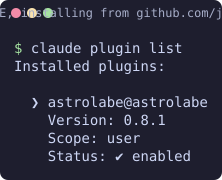

The two-step form does the same thing:

```text
/plugin marketplace add jonyfs/astrolabe
/plugin install astrolabe@astrolabe
```

From a shell it is the same two commands (a real capture, on a machine where Astrolabe was not
installed):

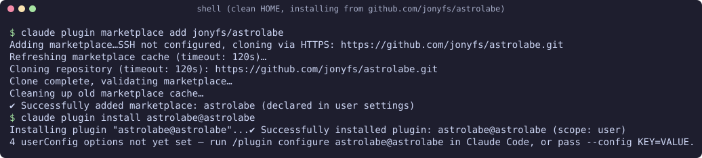

The four options start unset, which means their defaults (see [Options](#options)).

Installing changes no settings file by itself. Claude Code records the plugin and its
marketplace in `~/.claude/settings.json` (`enabledPlugins` and `extraKnownMarketplaces`),
the same as for any plugin, and the mod never writes there.

### Update and uninstall

```sh
claude plugin update astrolabe@astrolabe
```

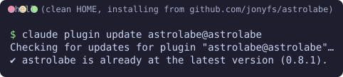

Then type `/reload-plugins` in a running session, or start a new one. Astrolabe also checks
for its own new release once a day and offers a button for it (see
[Update notices](#update-notices)).

```sh
claude plugin uninstall astrolabe@astrolabe
claude plugin marketplace remove astrolabe
```

### Install from a local clone

An install read from a folder runs the code on disk, but a session keeps the module it loaded.
With `autoReload` on (the default), Astrolabe compares the version on disk with its own after
each turn and runs `/reload-plugins` once when they differ, so a pull or a new release loads by
itself. The first version with this check needs one `/reload-plugins` of your own.

To try a working copy, add the folder as a marketplace. Claude Code then reads the plugin
from that folder, so edits show after `/reload-plugins`:

```sh
git clone https://github.com/jonyfs/astrolabe ~/src/astrolabe
claude plugin marketplace add ~/src/astrolabe
claude plugin install astrolabe@astrolabe
```

For a one-off session without installing, run `claude --plugin-dir ~/src/astrolabe`.

## What the status entry shows

Astrolabe adds one entry to the status line under the prompt. Claude Code puts the mod's
name in front of it:

```text
  ⚠ astrolabe: ◆ 002 · implement 45% · 7d 81% hold
```

Each part, from left to right:

| Part | Example | What it means |
|---|---|---|
| `⚠ astrolabe:` | | Drawn by Claude Code, not by the mod. It marks a line that a mod wrote, and it names the mod. |
| `◆` | | The Spec Kit marker. Every Astrolabe entry starts with it. |
| Feature id | `001` | The three-digit number of the active feature, from its folder name `specs/001-core-state/`. The Spec Kit part is at most 68 characters with the `⚠ astrolabe:` prefix, and the usage part adds at most 18 more, so it fits whole at 100 columns and wider; Claude Code cuts what does not fit. |
| `~` before the id | `~002` | The feature was guessed. `.specify/feature.json` exists but is broken or points at a folder that is not there, so Astrolabe fell back to the git branch or the newest open feature. Fix or delete `feature.json` and the `~` goes away. |
| Phase | `implement` | The first Spec Kit step this feature has not finished. See [Phases](#phases). |
| Percentage | `87%` | Ticked tasks out of all tasks in the feature's `tasks.md`, rounded down. 43 of 49 is `87%`. It appears only once `tasks.md` has tasks. |
| Running step | `· plan…` | A Spec Kit skill such as `/speckit-plan` was called during this turn. It disappears when the turn ends. |
| Usage window | `· 7d 81% hold (Mon 14:00)` | The window that decides, its band when it is not ok, and when it resets: a countdown such as `2h13m` when the reset is less than a day away, else the weekday and time. A window at or past 100% reads `full`. The other window follows. See [Usage governance](#usage-governance). |
| Context | `·  61%` | How full the context window is. Past 85% it reads `86% compact soon`. |
| Model and effort | `·  opus 5.5 high` | The model and effort of Claude's last request in the main thread. With the 1M context window it reads `opus 5.5 1M`. |
| Running skill | `· ⟳ implement · sonnet 5.5` | The Spec Kit or gstack skill running now, with the model `skillModels` picked for it. |
| Git | `·  main ↑2  3` | The branch, commits to push and to pull, and changed or untracked files, from one `git status` at the end of each turn. Without a repository it is left out. |
| Burn rate | `· 🔥 12/h → 96%` | Usage points an hour over the session, and where the window that decides will be at its reset at that pace. It shows once the session has two readings that rise. |
| Duration | `·  1h05m` | How long the session has run, from its first minute on. |

### The footer in place of a statusline

The footer carries what a statusline under the prompt usually shows, so you can remove a
separate `statusLine` command from your settings. By default it sits at the bottom of the
`/astrolabe` pane, under every tab, and the status entry keeps only the Spec Kit part and the
window that decides (`◆ 002 · implement 45% · 5h 42% (2h13m)`). Set `footerIn` to `status` to put
the whole footer back in the status entry, or `both` for both places. On a tab shorter than the
pane the footer holds the last rows; the Dashboard is longer, so its footer follows the charts.

In the pane the footer is drawn the way the [statusline](https://github.com/jonyfs/statusline)
project draws its bar: Powerline chips in Catppuccin colours. Spec Kit is mauve, the model red, git
lavender, and the usage windows and the context follow statusline's ramp: green below
60%, yellow to 85% (`5h 72%▵`), red above (`5h 94%▴`). The context takes the colour without the
mark. The `flavor` option picks the palette; with `ascii` icons, the accessible mode or the
`NO_COLOR` environment variable set, the footer is plain text with ` · ` between the parts.

When the room is too narrow, the parts go from the end: duration first, then the burn rate, git, model,
the other window and the context. The Spec Kit part and the window that decides always stay.

| A statusline showed | In Astrolabe |
|---|---|
| Directory, repository, branch, ahead and behind, changed files, stashes, worktree | The footer's git part (the directory is the project you opened) |
| Model, effort, context window | The footer |
| 5-hour and 7-day windows with their resets | The footer, and the governor acts on them |
| Session duration | The footer (Astrolabe shows no cost: on a subscription it means nothing) |
| Burn rate and projection | The Dashboard tab |
| Todo progress, Claude working or idle | The band, the spinner and the Tasks tab |
| Skills in use | The band and the prompt hint show the running Spec Kit skill |
| Pull request and last CI run | The footer's git part with the `pullRequest` option on |
| Prompt cache timer | A toast 30 seconds before the cache goes cold (see [Toasts](#toasts)) |
| Vim mode, rtk savings | Left out |

The git part reads like this with `icons` set to `ascii`:

```text
git:023-git-footer ^2 ~3 stash:1 wt:review PR#32 ok
```

`^2` and `~3` are commits ahead and changed files, `stash:1` is one stash entry, and `wt:review`
says the checkout is the linked worktree `review`. `PR#32 ok` is the branch's open pull request
with every check passed; `x` means one failed and `..` that some are still running. The pull
request part needs the `pullRequest` option and the `gh` command, signed in. Astrolabe asks `gh`
at most once every five minutes per branch, on a timer after the turn, so a slow network never
holds the footer. Without `gh`, or with no pull request for the branch, the part is left out.

Icons follow the `icons` option: Nerd Font glyphs in the terminal and emoji in the Desktop app by
default, or `ascii` for plain characters everywhere. A Nerd Font cannot be detected, so pick
`emoji` or `ascii` if the glyphs show as boxes.

The other entries you may see:

| Entry | When |
|---|---|
| `◆ no Spec Kit` | No folder from the session's directory up to the filesystem root holds a `.specify/` directory. Nothing else is read. The band only shows update buttons, if any (image below). |
| `◆ no active feature · next: /speckit-specify` | Spec Kit is set up, but every feature is done or abandoned, or there are none yet. The command after `next:` is the one to run. |
| `◆ no active feature · next: /speckit-constitution` | Same, and the constitution is missing or still the unfilled template. |
| `◆ 003 · abandoned` | `feature.json` names a feature whose spec says `status: abandoned`. A percentage follows when it has tasks (`◆ 003 · abandoned 40%`). |
| `◆ 001 · done 100%` | `feature.json` names a finished feature. Run `/speckit-specify` for the next one. |
| `… · 5h 42%` | The fuller usage window, with its band when it is not ok (`5h 83% hold`). See [Usage governance](#usage-governance). |

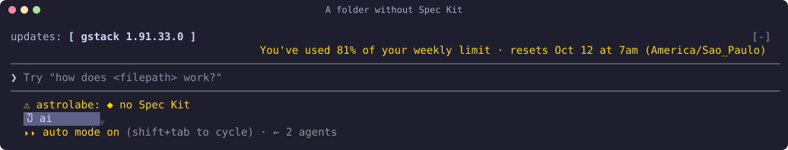

### Phases

The phase is read from the files on disk, top to bottom; the first rule that matches wins.

| Rule | Phase | What to run next |
|---|---|---|
| `spec.md` front matter says `status: abandoned` | `abandoned` | `/speckit-specify` for a new feature |
| `spec.md` front matter says `status: done` | `done` | `/speckit-specify` |
| No `spec.md` | `specify` | `/speckit-specify` |
| Front matter says `track: quick` | `implement` | `/speckit-implement`, until you set `status: done` |
| No `plan.md`, and `spec.md` still has `[NEEDS CLARIFICATION` | `clarify` | `/speckit-clarify` |
| No `plan.md` | `plan` | `/speckit-plan` |
| No `tasks.md`, or no tasks in it | `tasks` | `/speckit-tasks` |
| Some tasks open | `implement` | `/speckit-analyze` before the first tick in a session, then `/speckit-implement` |
| All ticked, front matter says `status: active` | `implement` (100%) | Set `status: done` when you agree it is finished |
| All ticked | `done` | `/speckit-specify` |

### When it updates

Astrolabe reads every feature once when the session starts. At the end of each turn it
re-reads `feature.json`, the constitution, the `specs/` listing, the active feature, and any
other feature a tool touched during the turn, so a box you tick in another editor shows up
when the next turn ends. While a turn runs, an edit or write by Claude to `spec.md`,
`plan.md` or `tasks.md` updates the entry right after that tool call.

A project with 40 features costs one full read per session and a handful of file reads per
turn.

## What the band shows

The band is the row directly above the prompt (the first row in the image at the top):

```text
◆ 002 shopping-cart  constitution ● specify ● clarify ● plan ● tasks ● implement ◐  ████░░░░░░ 9/20 45%
```

| Part | Example | What it means |
|---|---|---|
| Id and name | `◆ 002 band-hint` | The active feature, from `specs/002-band-hint/`. A `~` before the id means the feature was guessed, as in the status entry. |
| The rail | `constitution ● specify ● … implement ◐` | The six Spec Kit steps in order. `●` is finished, `◐` is the step the feature is in now, `○` is still ahead. The constitution is `●` once it is ratified; while it is missing or still the template it is `◐` and every later step is `○`. When a spec still has `[NEEDS CLARIFICATION` after its plan exists, the current step turns red and shows `?` instead of `◐`. |
| `…` after a mark | `plan ◐…` | A Spec Kit skill for that step is running in this turn. |
| The bar | `███████░░░` | Ten cells, one per tenth of the tasks ticked, rounded down. It appears once `tasks.md` has tasks. |
| The count | `9/20 45%` | Ticked tasks, all tasks, and the percentage rounded down. |
| Sparkline | `▂▃▅▆` | The deciding usage window over its last 12 readings, one block per reading, from 0% (`▁`) to 100% (`█`). It shows once there are 3 readings, on a band of 70 columns or more. |
| Update buttons | `updates: [ gstack 1.91.33.0 ]` | A second row when something has a newer version. See [Update notices](#update-notices). |

With the pointer on a step of the rail, a card under the band says what the step is for and how
many features are in it (`plan: the technical plan, research and data model · 2 features here`).

A finished feature shows every mark as `●` and a full bar. An abandoned feature named by
`feature.json` shows `◆ 003 name  abandoned` instead of the rail.

Below 100 columns the rail shows only the current step's name; the hover cards name the others.
When the band is narrower, it drops detail in this order and never cuts the id: the labels of
the finished and later steps, then the name, then the bar. Below that it turns compact: the
current step and the count (`◆ 002  ◐ implement 14/31 45%`), then the rail alone, then the step
alone (`◆ 002  ◐ implement`), then `◆ 002`. The `bandDensity` option starts lower: `compact` at the
current step and the count, `minimal` at the step alone. A `+2` after the name counts the other
features in progress, and `⑂ name` names the worktree where the active feature is being worked on.

On the next-command row, the run button is where the focus starts, so Enter runs it once the band
has the keyboard, and with the pointer on it a line says why it is next (`the plan is ready: break
it into tasks`). In a 100-column terminal it looks like this:

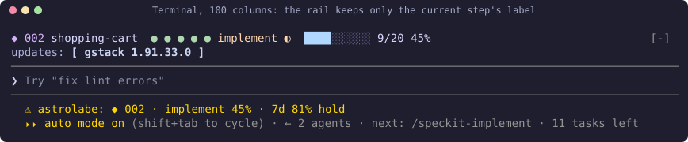

The band shows nothing of its own when the project has no Spec Kit, when no feature is active
(the prompt hint then names the command to run), or while a survey uses the band. Whatever
other mods draw there stays.

## What the spinner says

While a turn works on the active feature, the spinner line names the task in progress and how
long it has been the current one:

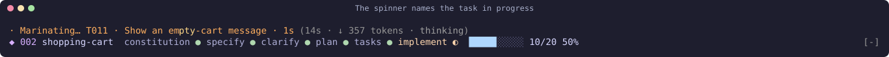

Claude Code still draws its own word and, after Astrolabe's part, the turn's time and token
count. Astrolabe only adds the part after the word:

| Part | What it means |
|---|---|
| `T011` | The id of the first open task in the active feature's `tasks.md`. |
| The text | The task's text without the `[P]` and `[US1]` markers or backticks, cut with `…` when the terminal is narrow. The id is never cut. |
| `1s` | How long this task has been the first open one, counted from when Astrolabe first saw it this session: `45s`, `12m` or `1h 5m`. |

It shows only during a turn that works on the active feature, meaning `/speckit-implement` was
called, or Claude read or edited a file in the feature's folder during the turn. A read counts
from the moment it starts, so the narration shows early in a short turn. Other turns keep the
plain spinner. When Claude Code shows its own message on the spinner (while compacting, for
example), that message wins.

## The next command

Under the band, a row shows the next Spec Kit command as a button. Press it and the command
runs, as if you had typed it. From 60 columns a `copy` button sits beside it and copies the
command. Each time the next command changes, it is also proposed in the empty prompt box: press
Tab (or the right arrow) to take it. `/astrolabe next` runs it from the prompt. The `minimal`
preset shows none of this.

The row's buttons have keys once the band has the keyboard (ctrl+x tab, or a click): `n` runs
the next command, `c` copies it, and `a` opens the `/astrolabe` pane (from 70 columns).

### Acting on a spec

`/astrolabe priority 3 high` (or `normal`, `low`) orders a spec within its section of the Specs
tab: high ones first with `↑` before the id, low ones last with `↓`. On the Specs tab, `p`
cycles the active spec through normal, high and low. Priorities are kept per project in
Astrolabe's own store; nothing is written in the project.

`/astrolabe review` (or `/astrolabe review 3`) sends the spec's `spec.md`, `plan.md` and
`tasks.md`, with the names of the constitution's principles, to a stronger model (`opus`, effort
`xhigh`) and asks for at most 10 findings: what is missing, ambiguous, inconsistent or risky.
The answer lands in the Session tab under `review`, and a toast says when. Only you can start
it, by typing the command, since it costs that model's tokens.

`/astrolabe advisor` (or `/astrolabe advisor 3`) asks Claude to review the spec with its advisor:
Claude reads `spec.md`, `plan.md` and `tasks.md`, calls the advisor, reports what it finds and
proposes changes without editing anything. A mod cannot call the advisor itself, since the API
runs it inside Claude's own request, so this takes one turn. The `advisor review` button above
the active feature's summary does the same, and the Session tab counts the advisor's runs this
session. When that turn ends after the advisor ran, the Session tab also keeps Claude's report,
its first 12 non-blank lines under `advisor 002`. Only you can start it.

When gstack is installed, that row also holds its skills, above the active feature's
summary: `investigate`, `review`, `health`, `qa-only` and `retro`. A press runs that skill with
the active feature named in its arguments.

`/astrolabe doctor` checks what Astrolabe needs and prints the fix next to anything missing:

```text
🧭 Astrolabe doctor
  ✓ git version 2.50.0
  ✓ gh version 2.80.0
  ✗ gh not signed in: run gh auth login
  ✓ specify 0.4.2
  ✓ Spec Kit project at /proj
  · icons: nerd (needs a Nerd Font in the terminal; set icons to emoji or ascii if glyphs show as boxes)
  · options: all defaults (change them in /config or the Config tab)
  ✓ slowest hook work: state update, 42 ms of the 10 s budget
```

The last line times every state update since the plugin loaded and names the slowest. It turns
into a `✗` past 5 s, half of the 10 s the engine gives each hook.

`/astrolabe status` prints the active feature, the next command and the footer as text, with the
band drawn above it in the terminal:

```text
◆ 002 band-hint: implement, 9/20 tasks (45%)

next: /speckit-implement

◆ 002 · implement 45% · 5h 42% (2h13m) · ctx 61% · opus 5.5 high · git:main ~2
```

When Claude ticks tasks with an Edit, the tool's row in the transcript names them
(`↳ ticked T010 task 10`).

## What the prompt hint shows

While the prompt is empty, Astrolabe adds the next Spec Kit command to the end of Claude
Code's hint line, after whatever is already there:

```text
⏵⏵ auto mode on (shift+tab to cycle) · next: /speckit-implement · 4 tasks left
```

The command is the one in the [Phases](#phases) table. In the implement phase it also counts
the tasks left. It disappears as soon as you type.

## Options

Seven options appear in Claude Code's config menu (`/config`, then Astrolabe). Changing one
reloads the mod right away.

| Option | Values | Default | What it changes |
|---|---|---|---|
| `preset` | `minimal`, `compact`, `full` | `compact` | Where Astrolabe draws. `minimal` keeps only the status entry. `compact` adds the band, the prompt hint, the spinner narration and the drift alarm. `full` also opens the `/astrolabe` pane by itself on a wide fullscreen terminal, and shows phase toasts as well as the drift alarm. |
| `flavor` | `mocha`, `frappe`, `macchiato`, `latte`, `theme` | `mocha` | The Catppuccin palette for the band. `latte` is the light one. `theme` takes Claude Code's own theme colors, so the band and the pane follow your light or dark theme; the Dashboard charts then use `latte` on a light theme and `mocha` on a dark one. |
| `checkUpdates` | `true`, `false` | `true` | The daily update check and its buttons (see [Update notices](#update-notices)). |
| `governUsage` | `true`, `false` | `true` | Usage governance (see [Usage governance](#usage-governance)). Off, the windows still show. |
| `icons` | `auto`, `nerd`, `emoji`, `ascii` | `auto` | Icons in the footer and the Dashboard. `auto` is Nerd Font glyphs in the terminal and emoji elsewhere. |
| `language` | `auto`, `en`, `pt-BR`, `es`, `fr` | `auto` | The language of the pane, the Dashboard, the governor's questions, the toasts and `/astrolabe help`. `auto` follows the language you type in, English until a prompt says enough. What Claude reads (refusals, resume prompts) stays in English. |
| `claudeContext` | `true`, `false` | `true` | Tell Claude about the Spec Kit work: one line on the active feature, its current task and the next command rides along with your prompt when it changed, and a Spec Kit skill gets the constitution's principles as a reminder. |
| `featureSummary` | `true`, `false` | `false` | When a feature's tasks are all done, ask `haiku` for a five-line summary, shown in the Session tab. It uses a little of your usage. |
| `humanize` | `true`, `false` | `false` | Add short humanizer rules to Claude's system prompt for everything it writes in the project: plain prose, no hype words, no em dashes, facts kept exact. |
| `terse` | `off`, `lite`, `full` | `off` | Ask Claude to answer briefly. `lite` keeps full sentences; `full` drops filler and articles. Files, commits and PR text stay normal prose. |
| `skillModels` | `off`, `auto` | `off` | `auto` sends each Spec Kit and gstack skill's requests with the model and effort it does best with, as the Help tab lists them (Opus for specify, clarify, plan, analyze and review; Sonnet for tasks, implement and ship; Haiku for quick reports). Switching models re-reads the context, so on a long session it costs more. |
| `accessible` | `true`, `false` | `false` | Text only, for screen readers and plain terminals: ASCII icons, charts as text, no hover styles on the band, no animated dial and no pictures. |
| `bandDensity` | `full`, `compact`, `minimal` | `full` | How much the band shows: the rail with step names when there is room, the current step and the count, or the id and the step. |
| `footerIn` | `pane`, `status`, `both` | `pane` | Where the footer goes: the bottom of the `/astrolabe` pane (the status entry keeps the Spec Kit part and the deciding window), the status entry, or both. |
| `autoReload` | `true`, `false` | `true` | After a turn, when the Astrolabe on disk is newer than the one running (an install from a local clone, an update), run `/reload-plugins` once so the new version loads. Off, a toast says to run it. |
| `images` | `auto`, `on`, `off` | `auto` | Draw the Dashboard's usage chart as a picture. `auto` does on kitty and Ghostty outside tmux. |
| `pullRequest` | `true`, `false` | `false` | Show the branch's open pull request and its checks in the footer, from `gh`. See [The footer in place of a statusline](#the-footer-in-place-of-a-statusline). |
| `askOnLimit` | `true`, `false` | `true` | Before it holds a subagent or pauses Claude, the governor asks you (see [Asked when it holds or pauses](#asked-when-it-holds-or-pauses)). Off, it holds and pauses without asking. |

You can also type `/plugin configure astrolabe@astrolabe` in a session, or set them from a
shell. Options you leave out keep their values:

```sh
claude plugin configure astrolabe@astrolabe                      # show the current values
echo '{"preset":"minimal","flavor":"latte"}' | claude plugin configure astrolabe@astrolabe --values-stdin
```

Colors are sent as hex values. On a terminal without truecolor, Claude Code decides how close a
color it can show.

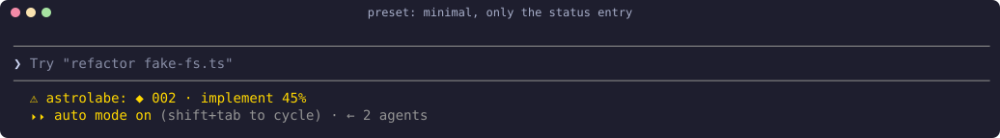

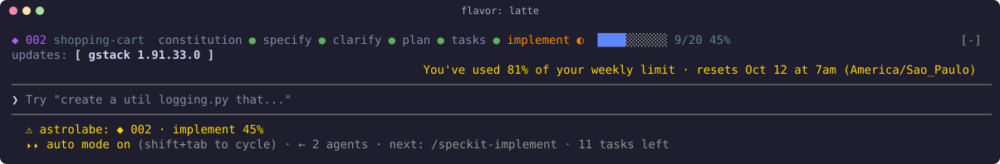

The current values, from a shell:

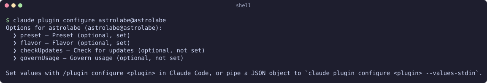

## The /astrolabe pane

The first session after you install Astrolabe shows one toast: `/astrolabe opens the pane,
/astrolabe help lists the commands`.

Type `/astrolabe` to open a pane with seven tabs (`/astrolabe help` lists every command and key). In a fullscreen terminal it docks at the
right; otherwise it sits above the prompt. It opens with the keyboard on it, so `1` to `7`
switch tabs right away, and Esc closes it. Later, focus it again with a click or
`ctrl+x tab`. The tab you pick stays for the session, and the next session of the same project opens on it.
On Specs, Tasks and Help, `f` puts the cursor in one filter that keeps the rows holding what you
type (a filter that keeps nothing says so); on Specs, `s` cycles a status filter (all, in progress, next up, done, abandoned), and `is:done` in the filter does the same; in a narrow pane the legend keeps only the keys; from 80 columns it ends with `updated 14:32`, when Astrolabe last wrote what the tabs show; `✕` at the end of the tab row closes the pane.

`h` opens the Help tab from any tab. The tab shown starts with `▸`, and the pane's title names the active feature the way the band and the footer do (`🧭 Astrolabe · ◆ 026 claude-context`, with `~` before the id when the active feature is a guess). Below 80 columns a tab shows only its number and count (`2·11`). A tab label carries a count when there is one: `Specs 3` features in progress, `Tasks 11` open
tasks of the active feature, `PRs 2` open pull requests. Above the footer, a dim row says what the
tab is for and lists its keys, such as
`every feature, its phase and progress · 1-7 tabs · h help · f filters · s status · j/k scroll · Esc closes`. A tab with
nothing to show says what would fill it and the command that does, for example
`No active feature. Run /speckit-specify to start one.`

The Help tab (and `/astrolabe help`) starts with what this version changed, lists every option
with its value now (`footerIn=pane`), the footer's parts in their fixed order (Spec Kit, deciding window, other windows, context, model, skill, git, burn, session time; a narrow screen drops session time first, then burn, git, skill, model, the other windows and context), and ends with a legend of every mark Astrolabe draws (`◆`, `●`,
`◐`, `○`, `?`, `▸`, `⟳`, `~`, `!`, `☐`, `⑂`, `⇉`, `⏱`) and a glossary of the six Spec Kit steps.
A toast about a failure names the command that fixes it, for example
`🧭 #42: not mergeable; run gh pr merge 42 --merge`.

**1 Specs** lists every feature:

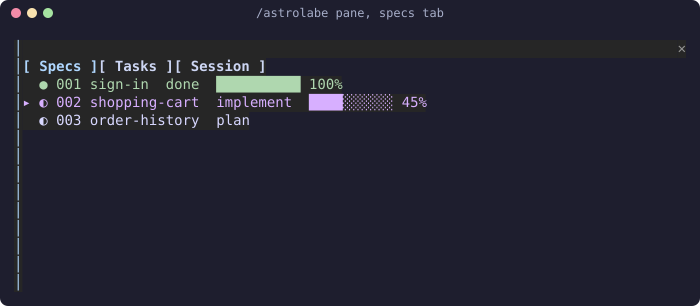

Features sit under section headers: `In progress (N)`, `Next up (N)`, `Done (N)` and
`Abandoned (N)`. Every row has the same columns: id and name, phase, a progress bar, the task
count and the percent.

```text
In progress (1)
▸ ◐ 002 band-hint   implement  ████░░░░░░   9/20  45%  ⟳ speckit-implement
Done (1)
  ● 001 core-state  done       ██████████  49/49 100%
```

`▸` marks the active feature. `●` is done, `◐` in progress, and `○` abandoned (drawn dim). `?2` and `☐3` count a spec's open questions and open checklist items, and `↗` at the end of a row opens its `spec.md`; `plan↗` and `tasks↗` follow once those files exist (terminal only: the Desktop app does not open `file:` links). While a
Spec Kit skill runs, `⟳` and the skill's name follow the active feature. A narrow pane drops the
bar first, then the count, then cuts the name; the id always stays. If `.specify/feature.json`
names a done feature while the git branch names one that is not done, a `!` line says so and
gives the path to set. Under the list come the other warnings: a `~` line when the active feature was guessed because
`.specify/feature.json` is broken, a `!` line for a spec that still has
`[NEEDS CLARIFICATION` after its plan exists, a `?` line with how many markers a spec still has
before its plan, and a `☐` line with the open items of a feature's `checklists/*.md` until the
feature is done.

Above the list, a filter field keeps the features whose id or name holds what you type, and the
active feature's summary shows its title, its first paragraph and its user stories with their
priority, followed by links to its `spec.md`, `plan.md` and `tasks.md` (only the files that
exist). In the terminal a link opens the file with ctrl or cmd and a click, as your terminal
opens `file:` links.

The tabs follow Claude during a turn: a Write of `.specify/feature.json` or the constitution, a
Bash command that makes a spec or switches the branch, and a subagent's return all redraw them at
once, without waiting for the turn to end.

Where the row has room, its phase takes its colour on the rail (clarify and implement peach, plan blue, tasks mauve) and the bar its fill and empty colours. A spec's own warnings sit right under its row, the blocking ones first (a file that cannot be read, a missing `spec.md`). With no filter, Done and Abandoned past three features fold to their heading (`Done (12) · folded; s or is:done shows them`). The Help tab explains each gate. Under the active feature a dim `gates` row shows where it stands: `constitution ✓  clarify ✗2  checklist ✗3  tasks ✓  analyze –` (`✓` passed, `✗` with what is open, `–` not reached yet). A feature row names the worktrees working on it (`⑂ wt-a`); one feature open in two worktrees gets a `!` line, since their changes will collide. `/astrolabe worktrees` lists every worktree and the feature it works on, as text. A worktree row also says how many files it has not committed (`· 3 uncommitted`) and, once its branch is merged into the main checkout's branch, `· merged · git worktree remove /path/to/it`. A folder under `specs/` with no `spec.md` gets a `?` line naming it.

When the repository has other git worktrees, the features they work on show under the list, read
after each turn from the branch name (`026-...`) and that worktree's files:

```text
⑂ astrolabe-dev  ◐ 026 claude-context  implement 3/5
```

**2 Tasks** lists the active feature's open tasks in file order, after a count. In the terminal each task ends with `↗`, a link to its line (`tasks.md#L42`, or `spec.md` for a quick spec):

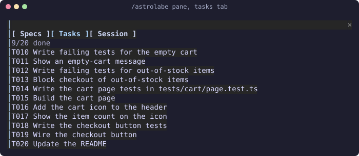

The task being worked on is marked `▸` and shows how long it has run (`▸ T010 Write x.ts  ⏱ 12m`). The last turn's diff of `tasks.md` shows at most 6 lines and a `… +N lines` line. The first row names the feature, its phase and its count (`026 claude-context · implement · 9/20 done`). Ticked tasks fold into one dim row (`✓ 9 done · T001…T009`). Headings of `tasks.md`, such as `Phase 3: User Story 1 · 2/5`, head their tasks with their own count, and a run of `[P]` tasks is bracketed with `┌`, `│` and `└` (a lone one gets `⇉`); the `⇉ … can run in parallel` line shows only when no bracket does. When the open tasks, at the time the ticked ones took, would end after the 5-hour window resets, a `⚠` line says so. When more tasks are open than the pane has rows, the last line says `+N more`. A feature with
no `tasks.md` yet says so; a quick spec (`track: quick`) uses the `## Tasks` section of its
`spec.md` instead. When two or more `[P]` tasks come first among the open ones, a `⇉` line names
them: they can go to subagents at once.

Above the count, the last main turn's change to the task list shows as a diff: each box it
ticked or unticked, with its line number in the file. It stays until a later turn changes the
list again.

**3 Session** shows how Astrolabe sees the project right now, and any updates: Its rows sit under four headings: Project, Governor, Activity (summaries, reviews, advisor runs) and Updates. The Project block also shows the branch; in the terminal its `↗` opens the branch's page on the remote (`git remote get-url origin`, asked once a session). In the terminal, an update to Astrolabe or Spec Kit ends with `↗`, a link to that version's release notes. The governor's `state` row is green when all is clear, yellow while it slows down or holds, and red when paused.

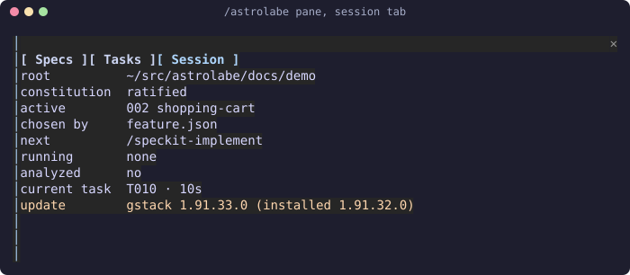

`chosen by` is how the active feature was picked (`feature.json`, `branch` or `latest`).
`analyzed` says whether `/speckit-analyze` ran in this session on the current `tasks.md`. Ticking a task keeps it; adding, removing or rewording a task sets it back to `no` until analyze runs again. `hooks before` and `hooks after`
list the Spec Kit extension hooks (`.specify/extensions.yml`) around the next command. When that
file has a line Astrolabe cannot read, a red `extensions` row names it, for example
`.specify/extensions.yml line 3: not an event, an item or a key: value; its hooks are not read`.
A tab in the indentation and an unclosed quote are named the same way. In a
folder with several Spec Kit projects under it, `other roots` names them, and
`/astrolabe root <folder>` reads one of them as the session's project.

**4 Dashboard** puts the session in numbers and charts:

- a first row of chips: tasks done, burn rate, context and where the deciding window lands at its reset (`tasks 9/20 │ burn 12/h │ context 61% │ 5h at reset 70%`), the burn and context chips green, yellow or red like the footer;
- an astrolabe dial with the six Spec Kit steps around a ring, the active feature's step marked
  `●` with the needle on it, earlier steps ticked `✓`;
- the active feature's tasks done out of all of them;
- one bar per phase with how many features are in it;
- a line chart of the deciding usage window over the session, 0 to 100%, with a dotted
  projection to the reset at the current burn rate, and a legend under it that says what `●`,
  `│` and `·` mean;
- the session's counts (drift alarms and subagents appear once there is one): turns, tool calls, drift alarms (with the features they came from, `3 (002: 2, 004: 1)`), subagents run and queued, context, tasks an hour, turns a task (to see when Claude spins), context a task (the window points each ticked task used, the ones compactions freed included), compactions and the context they freed, how long work waited on the governor,
  duration, burn rate in points an hour, and where the window should be at the reset;
- a sparkline each for the 5-hour window, the weekly window and the context over the last readings;
- the slowest task of the active feature, an estimate for its open tasks from the time the ticked
  ones took, and the tasks and features finished this week, across sessions, with a block per weekday for
  the tasks ticked on it (`▂▅█▁    M T W T F S S`).

A turn that ticked tasks says so next to its duration (`Baked for 1m 1s · 2 tasks done`). The
Session tab shows the governor's steps of the day (at most 10): what it asked, what you answered, and when it
resumed.

The dial sweeps its needle from the first step to the active one when the tab opens, then
holds still. On kitty and Ghostty (outside tmux) the usage chart is a picture, with dashed
lines for the projection; the `images` option turns that `on` for other terminals that show
pictures (iTerm2, WezTerm) or `off`.

In the terminal the charts are drawn cell by cell in the theme's colors; in the Desktop app and
VS Code they are vector images; with `icons: ascii`, or where neither is drawn, they are plain
text. A pane too narrow for a chart shows its numbers instead. Drawing reads only what the
session already holds, never a file.

A tab longer than the pane scrolls inside it while the footer stays on the last rows. A
`▲ 3 more (k)` or `▼ 12 more (j)` row says what is hidden; press it, or `k` and `j` while the
pane has the keyboard, or use the wheel and the arrow keys. The Dashboard scrolls by whole
sections, so a chart is never cut in half.

**5 Help** lists the `/astrolabe` commands, the pane and band keys, and the options, in your
language.

**6 Config** lists every Astrolabe option as `/config` holds it, under four headings (Display, Governor, Claude, Integrations), with a control for each: a picker
for a choice, a toggle for on and off, a field for a number or a text. A changed row is marked `●`.
`Save N changes` applies them through Claude Code's settings, and Astrolabe reloads with the new
values; `Cancel` drops them. A row your organization's policy locks shows its value and cannot be
changed; `•` marks an option saved with a value other than its default. `Reset to defaults` puts every option back to its default as a draft that Save applies; `/astrolabe config reset`, typed by you, does it at once.

**7 PRs** lists the repository's open pull requests, read with `gh` when the tab opens and at most
every two minutes after a turn while it is shown. Each row links to the pull request and shows its
checks (`✓` passed, `✗` failed, `…` running), its review state, its labels and its branch. In the
terminal a third line links each check to its run page, six at most (`✓ test (macos)`). The
buttons GitHub would allow sit beside it: `Approve`, `Update branch` when the branch is behind its
base, and `Merge` when it is ready. When `gh pr list` fails or does not answer in 8 s, the tab says why and names `gh auth status`. Each asks for a second press before it runs: the button reads `Press again to merge #42`, and after 10 s without it the button asks again from scratch. A merge waits for green checks.

With the `full` preset, the pane also opens by itself once per session, at the end of the
first turn, but only in a fullscreen terminal at least 144 columns wide. It never opens by
itself on a narrower or non-fullscreen terminal.

## What Claude is told

With `claudeContext` on (the default), Claude reads one line about the Spec Kit work next to your
prompt, and only when it changed since the last one:

```text
Astrolabe: the active Spec Kit feature is 002 band-hint, phase implement, 9 of 20 tasks done; the current task is T010 task 10; the next command is /speckit-implement.
```

The line rides on the message, not in the system prompt, so the prompt cache stays whole. When a
Spec Kit skill runs, Claude also gets the constitution's Core Principles by name as a reminder to
check the step against them. When the governor resumes paused work, its prompt says where the work
stopped (`The work stopped at T010 task 10 in 002 band-hint.`).

`/astrolabe ask <question>` asks Claude about the active feature without a turn: the question goes
to a fork of the session (the same context, served from the cache, no tools) and the answer shows
in a toast.

## Toasts

Astrolabe raises short notices in Claude Code's toast area. Each marks a change, never a
turn, so they stay rare. The drift alarm and the phase toast follow the preset; the usage
notices at the end of this section show in every preset.

**Drift alarm** (presets `compact` and `full`). When Claude ticks a task in `tasks.md` but no
code file was edited in the turn, you see (captured after asking Claude to tick T010 and do
nothing else):

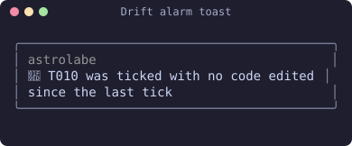

If the task names files, at least one of them has to have been edited, or the toast lists them:

```text
🧭 T014 was ticked, but none of its files were edited: tests/core/parser.test.ts
```

A task about tests that names no file, ticked while code changed but no test file did, raises
one too:

```text
🧭 T009 was ticked, but no test file changed
```

A code file is any file inside the Spec Kit root that is not under `specs/` or `.specify/`,
edited with Edit, Write or NotebookEdit, by Claude or by a subagent. The check covers one turn:
any code edit in the turn covers every tick in it, and a turn raises the alarm at most once. It
stays quiet when a Bash or Agent call happened in the turn, because the mod cannot see what
those changed. A box you tick in your own editor never raises it.

Two limits to know: edits outside the Spec Kit root (code beside a nested `.specify/` in a
monorepo) are not seen, and in a batch of parallel tool calls a tick that runs before its code
edit raises the alarm.

**Phase toast** (preset `full` only). When the files on disk show that a feature moved to a
later phase, you see it once per session:

```text
🧭 002 band-hint moved to tasks · next: /speckit-tasks
🧭 002 band-hint is done · next: /speckit-specify
```

To decide what is new, Astrolabe remembers each feature's last seen phase for the session.
The first check of a session only records the phases, so a change made between sessions does
not toast, and two sessions open on the same project each toast on their own. A Spec Kit skill that starts never toasts by itself; only the files count.

To turn the toasts off, pick the `minimal` preset, or `compact` to keep only the drift alarm.

When three turns in a row work on the same task and tick nothing, a toast says so once: `🧭 three turns on T010 and nothing ticked: /compact, or split T010 into smaller tasks`. With `claudeContext` on, the line Claude reads also names what still blocks the feature: open `[NEEDS CLARIFICATION]` markers, open checklist items, and `/speckit-analyze` not yet run before the first task. A prompt that names another feature by its id (`fix the bug in 001`) also gets a line saying which feature is active, since `.specify/feature.json` decides what Spec Kit skills work on.

The first `/speckit-implement` on a feature whose `spec.md` still has `[NEEDS CLARIFICATION` markers is refused. Claude reads why: `Astrolabe: feature 001 auth still has 1 open [NEEDS CLARIFICATION] marker in spec.md. Run /speckit-clarify first. To implement anyway, call /speckit-implement again.` A second call in the same session goes through.

**Usage notices.** Each shows once a session:

```text
🧭 The context window is 86% full: /compact before Claude Code compacts it for you
🧭 The prompt cache goes cold in about 30 s: the next prompt after that re-reads the whole context
```

The context line shows at 85%, and once more
after the context drops below 70% (a `/compact`) and climbs back. The cache line shows 4.5
minutes after a turn ends with no newer turn, since Claude Code's prompt cache lasts 5 minutes.

When the governor resumes queued work after a window resets, it also sends a phone notice
through Claude Code's push notifications, if you have them on. Claude Code skips it while you
are at the terminal.

## Update notices

Once a day, the first time a session starts or a turn ends on a new day, Astrolabe checks four
things in the background and adds a row of buttons under the band for anything that has a
newer version:

```text
updates: [ gstack 1.91.33.0 ][ specify 1.2.0 ][ Spec Kit skills 1.2.0 ][ astrolabe 0.8.0 ]
```

| Button | How Astrolabe knows | What a click does |
|---|---|---|
| gstack | `~/.claude/skills/gstack/bin/gstack-update-check` exists and reports `UPGRADE_AVAILABLE` (Astrolabe reads `HOME`, or `USERPROFILE` on Windows, to find it, and runs nothing when gstack is not installed) | Runs the `/gstack-upgrade` command, which upgrades gstack and reports itself. |
| specify | `specify self check` names a newer release | Runs `specify self upgrade`, then toasts `🧭 specify updated to 1.2.0`. |
| Spec Kit skills | `specify version` is newer than this project's `.specify/integrations/speckit.manifest.json` | The first click turns the button into `confirm: rewrite .claude/skills/speckit-*`. The second runs `specify init --here --integration claude --force` in the project, which rewrites the project's Spec Kit skills. |
| astrolabe | GitHub's latest release of jonyfs/astrolabe is newer than the installed version | Runs `claude plugin update astrolabe`, then toasts that you should run `/reload-plugins`. |

On a narrow terminal the row keeps the buttons that fit and ends with `+N` for the rest. The
last button, `hide`, dismisses every update shown; each one comes back only when a newer version
than the hidden one appears. A button disappears once its update succeeds. When one fails, a toast gives the first error
line and the command to run yourself. A tool that is not installed is simply skipped.

This is the one network call Astrolabe makes: a single request a day to
`https://api.github.com/repos/jonyfs/astrolabe/releases/latest`. The results are kept in the
mod's store with the date, so other sessions the same day show them without checking again.
With the `minimal` preset there is no band, so the updates are listed in the `/astrolabe` pane's
Session tab instead (without buttons). To turn the checks off, set `checkUpdates` to `false`;
then Astrolabe runs no process and makes no network call.

## What Astrolabe reads

Only files inside the Spec Kit root, the nearest folder above the session's directory that
holds `.specify/`. It never writes a project file. It runs processes and makes one network call
only for the daily update check (see [Update notices](#update-notices)), and only when you
click a button does anything get installed. Its own store (the plugin's JSON file under your
Claude Code configuration folder) keeps only the last update check, the updates you hid, and the
tasks and features finished per week (the last 12 weeks).

| File | Used for |
|---|---|
| `.specify/feature.json` (`feature_directory`) | The active feature, when it names an existing `specs/NNN-name/` folder. |
| `.specify/memory/constitution.md` | Whether the constitution is missing, still the template (it contains placeholders like `[PROJECT_NAME]`), or ratified. |
| `specs/NNN-name/spec.md` | The front matter and any `[NEEDS CLARIFICATION` markers. |
| `specs/NNN-name/plan.md` | Only whether it exists. |
| `specs/NNN-name/tasks.md` | The tasks. |
| `.git/HEAD` (or the `gitdir:` file of a worktree) | The current branch, read as a file. |

A `spec.md` or `tasks.md` that exists but cannot be read (its permissions, or a lock another
program holds) shows in the `/astrolabe` pane as `! 002: tasks.md exists but could not be read`,
and Astrolabe tries it again every turn until a read works. If the session read the file
before, Astrolabe keeps that text, so the phase does not jump back. A constitution that cannot
be read also keeps its last text, without a pane row.

### Large projects

Past 150 features, a session start reads the active feature (from `feature.json` or the branch) and
the twenty newest at once, so the band draws right away, and reads the others in batches of 100
right after. Until its batch lands, a feature shows as `… 042 name` in the Specs tab.

### Which feature is active

1. `.specify/feature.json`, when its `feature_directory` names a folder under `specs/`
   that exists. Relative, absolute and Windows spellings all work.
2. Otherwise the git branch, when it is named like a feature folder (`002-band-hint`) and
   that folder exists.
3. Otherwise the highest-numbered feature that is neither done nor abandoned.

Spec Kit's `SPECIFY_FEATURE` and `SPECIFY_FEATURE_DIRECTORY` environment variables are
ignored: they are set in the shells Claude runs, not in Claude Code itself. Use `feature.json`
or the branch. The only environment variables Astrolabe reads are `HOME` and `USERPROFILE`, to
find gstack for the update check.

### Tasks

A task is a line that starts with `-` or `*`, a space and a checkbox: `- [ ]`, `- [x]` or
`- [X]`. Both `x` and `X` count as done (`/speckit-implement` writes `[X]`). Indented
checkboxes count. Lines inside fenced code blocks do not.

```markdown
- [X] T001 Create the manifests
- [ ] T002 [P] [US1] Write the parser tests
  - [ ] T003 Nested tasks count too
- [ ] fix the typo        <- ignored: this file has task ids, and this line has none
```

When any task in the file carries an id (`T001`), lines without one are skipped, so a
stray checklist in the same file does not change the count.

### Front matter

A spec can say what it is instead of letting Astrolabe guess. Put this at the very top of
`spec.md`:

```yaml
---
track: full    # quick | full
status: active # active | done | abandoned
---
```

`status: done` and `status: abandoned` win over every other rule. `track: quick` keeps a
spec with no plan or tasks in `implement`. This repository's spec template already adds the
block to new specs.

## Usage governance

Claude Code tells the mod how full your 5-hour and weekly windows are after every turn.
Astrolabe adds the window that decides to the status entry and acts on it:

```text
⚠ astrolabe: ◆ 002 · implement 45% · 5h 42%
⚠ astrolabe: ◆ 002 · implement 45% · 5h 83% hold
```

| Band | Window | New subagents (`Agent` calls) | Other tools |
|---|---|---|---|
| ok | below 60% | up to 6 at once | run |
| throttle | 60% to 80%, or a burn rate that would reach 80% before the reset | 3 at once below 70%, then 1 | run |
| hold | 80% or more, and down to 75% in the window that reached 80% | you are asked; by default refused and queued | run |
| stop | 88% or more | refused and queued | you are asked; by default only read-only tools (Read, Grep, Glob, LS, WebFetch, WebSearch, TodoWrite, Skill) |
| ceiling | 90% or more | refused and queued | you are asked; by default only read-only tools |

Each window is banded on its own and the one in the highest band decides, then the fuller one.
Once a window reaches 80%, it stays in hold until it falls below 75%, so usage that moves around
80% does not hold and release subagents again and again. When a window's reset time passes,
Astrolabe does not know the new percentage until Claude Code sends the next reading: the status
entry says `5h renewed` and subagents run one at a time until then.

A refused call tells Claude why and when the window resets, for example
`🧭 usage 5h 83% (hold): new subagents are queued until 14:00; queued as q1`. When the window
resets, or a new reading takes it out of hold, Astrolabe sends one prompt that lists the queued
subagents so Claude dispatches them again, and a paused session continues. A running subagent
is never stopped. The cap counts subagents running in the foreground; one started in the
background returns at once and is not counted. At most 20 subagents wait; past that, a refused
one is not queued and Claude is told to dispatch it again after the reset.

The Session tab says where the governor stands in plain words, for example
`holding (7d at 83%): new subagents wait until 14:00; other tools run`, and, at the pace of the
recent readings, when the next band comes (`hold at 80% in about 30m at this pace`). It lists
each queued subagent with the command that sends it now: type `/astrolabe run q1` yourself
(Claude, a plugin or a script cannot). The queue survives `/reload-plugins` and a new session: when one starts with subagents still waiting, a toast says so, for example `🧭 2 subagents still waiting since 14:02; /astrolabe run <id> runs one now`. While the session is paused, the footer's first chip turns
red and says until when: `5h 92% ceiling · paused until 14:00`.

Only you can lift stop and the ceiling, by typing the command yourself (a command sent by
Claude, a plugin or a script is refused):

```text
/astrolabe allow 95 2h
/astrolabe revoke
```

`allow` takes a target from 90 to 99 and a duration from `30m` to `12h`; it lasts until the
duration ends or the window resets. It lifts only the window that decided when you typed it, so
lifting the weekly window leaves the 5-hour window's stop and ceiling where they were. It does
not lift the hold at 80%; the question below can.

### Asked when it holds or pauses

When the governor queues a subagent at hold, or refuses one of Claude's tools at stop or the
ceiling, it refuses at once with the cautious answer and then asks you. Claude Code gives a hook
10 seconds, so the governor never makes Claude wait for you: Claude is told that you are being
asked and not to retry. The question opens in a pane with the keyboard on it. The arrows move
between the answers, Enter picks one, and the first answer, the cautious one, is already
selected:

```text
🧭 usage 7d 83% (hold): a new subagent, "Full review". What now?
❯ Queue it until Mon 07:00
  Run this one now
  Allow subagents for 1 hour, one at a time
  Drop this request
↑↓ to choose, Enter to pick. Esc or no answer: the default goes ahead at 12:01:00.
```

What each answer does:

| Answer | What happens |
|---|---|
| `Queue it until <reset>` | The subagent stays queued until the window resets. |
| `Run this one now` | It leaves the queue, and a prompt tells Claude to send it again; that one call goes through. |
| `Allow subagents for 1 hour, one at a time` | The queue is sent again, and new subagents run one at a time for the hour. |
| `Drop this request` | It leaves the queue; later subagents are dropped too while the band lasts. |
| `Pause until <reset>` | Claude stays paused until the window resets. |
| `Continue for 30 more minutes (ceiling 91%)` | The ceiling is raised for 30 minutes, and a prompt tells Claude to continue. |
| `Raise the ceiling to 95% for 2 hours` | The same, for 2 hours. |

Each ceiling is at least two points above current usage and at most 99%. An answer that cannot
raise the ceiling above current usage is left out. A prompt Astrolabe sends waits until Claude's
current turn ends.

If you do not answer within a minute, or you press Esc, the pane closes and the first answer
stands. The governor keeps that answer, and `Drop this request`, while the band lasts, so it does
not ask again for every call; it asks again once usage leaves the band and comes back. Only one
question is open at a time. Calls that arrive meanwhile are refused with the cautious answer too,
and the answer you pick covers them through the queue.

The pane needs 144 columns when nobody asked for it. On a narrower terminal the question shows
in Claude Code's own question dialog instead. That dialog stays open until you answer it, and
the answer applies whenever you give it.

Claude cannot pick an answer: it comes from your key press. Hooks and plugins you installed run
with your trust, though, and one that answers Claude Code's question dialog (a `PreToolUse` hook
on `AskUserQuestion`) could answer the narrow-terminal question for you. A session with no one at
the prompt (`claude -p`, the SDK) is never asked. A running subagent is never asked about and
never stopped. To turn the questions off, set `askOnLimit` to `false`.

`governUsage` and `askOnLimit` are plugin options. Anything that can run `claude plugin
configure` can change them, including Claude through Bash when you allow that command, so
review such a call before you approve it.

Off a subscription (an API key) there are no windows, so nothing is shown or refused. To keep
the readings but turn the governing off, set `governUsage` to `false`. If this project also
has the usage-governor skill's hooks installed, they govern too; keep one of the two.

The `/astrolabe` pane's Session tab shows the governor: the windows and the band, the subagents
running against the cap, the queue, an override and a lift with the time each one ends:

```text
usage         5h 42% · 7d 83%: hold
subagents     0 running, cap 0
queue         1 waiting: q1 Full review
override      ceiling 95% on 7d until 14:00
```

Astrolabe has the usage-governor skill's bands, caps, burn-rate projection, hysteresis,
per-window overrides, queue and resume, and it asks before it holds or pauses. It leaves out what
does not fit a mod:

- thresholds in a config file: the mod's options are plugin options, which anything that can run
  `claude plugin configure` can change;
- its own `/usage` probe: Claude Code sends the windows after every turn;
- a ramp for the queue after a reset: one subagent at a time until the next reading does that;
- a command line, an audit log, and Codex and Copilot.

## Where it works

| Surface | Draws |
|---|---|
| Terminal on Linux, macOS and Windows (Claude Code 2.1.287 or later) | Yes |
| Claude Desktop app, Code tab (2.1.286 or later) | Partly. Claude Code raises the band, the spinner and the pane there, and the status entry and toasts reach it, drawn with the app's own look. The prompt hint's `next:` text is not shown: Claude Code draws that part only in the terminal for now. Every image in this README comes from the terminal; none was captured in the app yet. |
| VS Code extension, `claude -p`, cloud sessions | No. The mod's hooks run but nothing is drawn, and nothing errors. |

CI runs the tests on Ubuntu, macOS and Windows for every pull request.

Astrolabe replaces jonyfs/statusline. It does not set `statusLine`, so if you still have a
classic status line command configured, both show.

## Troubleshooting

- **Nothing appears.** Check `claude --version` (2.1.292 or later) and
  `claude plugin list` (`astrolabe@astrolabe`, enabled). Mods draw only in the terminal and
  the Desktop app's Code tab.
- **The wrong feature shows, or a `~`.** Open `.specify/feature.json`. Its
  `feature_directory` must name a folder under `specs/` that exists, for example
  `"specs/002-band-hint"`.
- **A tick does not show.** The entry follows the disk at the end of each turn. Send any
  prompt and wait for the turn to end.
- **See what the mod did.** Run `claude --debug`. Any error Astrolabe caught is written to the
  debug log as a line starting with `astrolabe:`. While a plugin folder is hot-reloaded, the
  transcript also shows a dim line when a hook was skipped.

## From a statusline to a mod

[docs/tutorial/README.md](docs/tutorial/README.md) teaches, in eight steps, how to turn a
classic `statusLine` command into a mod, with jonyfs/statusline as the worked example and this
repository as the result. Each step pairs the file in one with the file in the other.

## Development

```sh
claude plugin validate .
claude plugin test .
sh scripts/fetch-engine-types.sh          # once: the engine's declarations for the type check
npx -p typescript@5 tsc -p .
```

The type check needs the declarations Claude Code writes for mods. They are not part of the
plugin and are not committed: `scripts/fetch-engine-types.sh` downloads them into
`types/engine/` from this repository's `engine-types-2.1.292` pre-release, and CI does the
same. After a Claude Code update, `scripts/sync-engine-types.sh` copies the new declarations
from your machine and prints the `gh release create` line that publishes them.

### Releasing

A release comes only from a tag `vX.Y.Z` equal to `plugin.json`'s `version`. Bump the version
in a pull request, merge it, then tag `main`:

```sh
sh scripts/check-release-version.sh v0.6.0   # the same check the release workflow runs
git tag -a v0.6.0 -m "Astrolabe v0.6.0"
git push origin v0.6.0
```

The release workflow checks the tag against `plugin.json`, runs validation, tests and the type
check again on Ubuntu, macOS and Windows, and creates the GitHub release with generated notes.
A tag that does not match never produces a release.

Installs follow `main`: the repository is its own marketplace, and `main` changes only through
reviewed pull requests and tagged releases.

### Process

Every change starts as a Spec Kit feature under `specs/` and goes through
`/speckit-specify`, `/speckit-clarify`, `/speckit-plan`, `/speckit-tasks`,
`/speckit-analyze` and `/speckit-implement`, test first. The rules are in
[.specify/memory/constitution.md](.specify/memory/constitution.md). Everything in this
repository is written in English.

## How the images are made

Every image is a real capture, never a drawing (Constitution Principle II):

```sh
scripts/capture/scene.sh overview-180 180 40 "$PWD/docs/demo" 30          # start claude in tmux, wait, capture
node scripts/capture/ansi-to-svg.mjs docs/images/overview-180.ansi docs/images/overview-180.svg --from "^◆ "
```

`scene.sh` starts `claude` in a tmux window of the given size, sends the keys you list (for
example `"/astrolabe" Enter 3 "keys:2"` to open the pane and show the Tasks tab), and saves
the screen with its colors. `ansi-to-svg.mjs` turns that into an SVG; `--from`, `--drop`,
`--crop` and `--cut` select the part to show. Inside tmux Claude Code draws with 256 colors,
so the images show the nearest match of each Catppuccin color. Lines from other status
providers (the author's own statusLine) and Claude Code's own usage notice are dropped, and
`--replace` shortens the author's home path to `~/src/astrolabe`; nothing else is edited.

## Privacy

Astrolabe has no server and no telemetry. [docs/privacy.md](docs/privacy.md) lists every file it reads, what it keeps in Claude Code's store, and the one request it sends (the daily update check).

## License

MIT. See [LICENSE](LICENSE).
